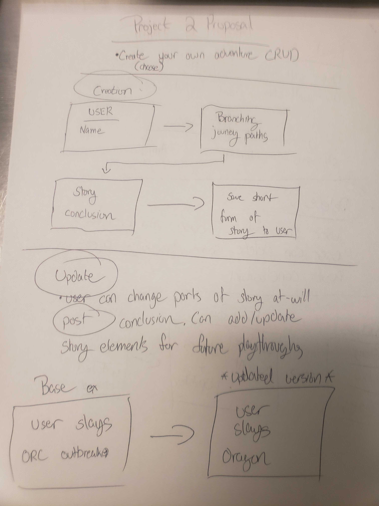
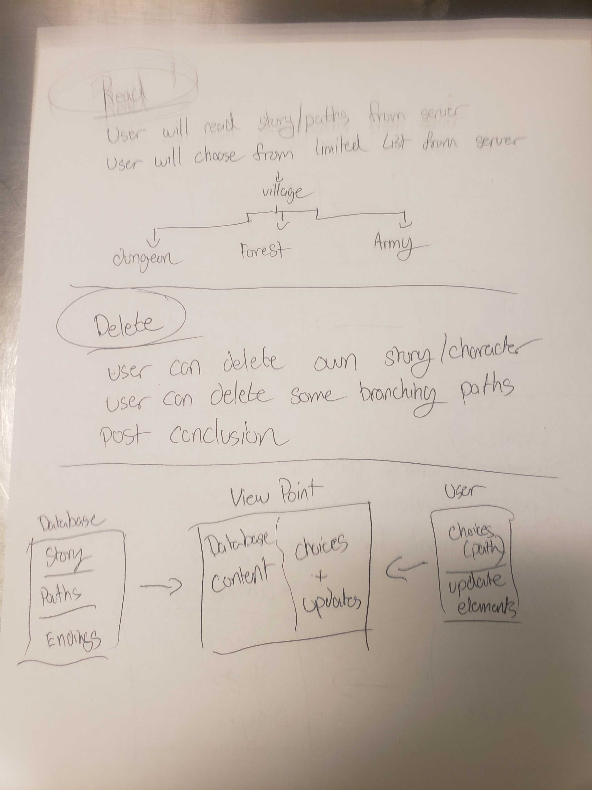
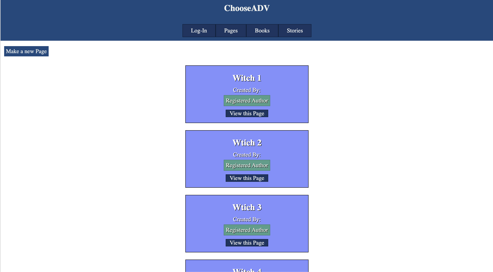
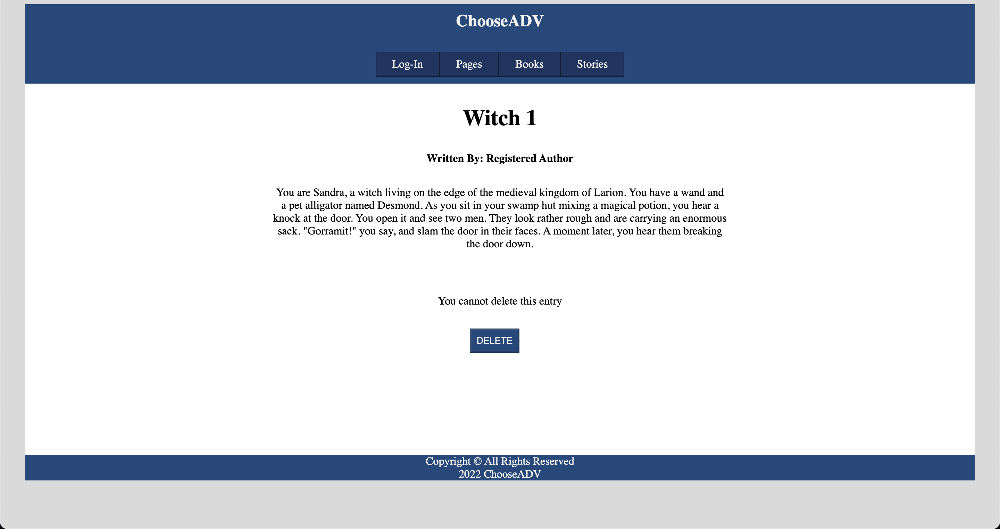

# Project 2 : Create your own Adventure
A Full-Stack app that takes user input and creates a mini-adventure story

# User Stories
* Users should be able to make choices in their story path
* Users should be able to update/change their story
* Users should be able to manipulate the story to their advantage

# Technologies Used
* HTML 5
* MongoDB
* Javascript
* AI Dungeon

# Screenshots
## Concept: 

# Getting Started

# Future Enhancements
* Add in basic combat
* Add basic abilites that can be manipulated by the User